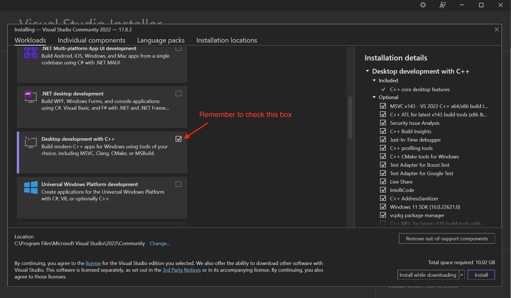
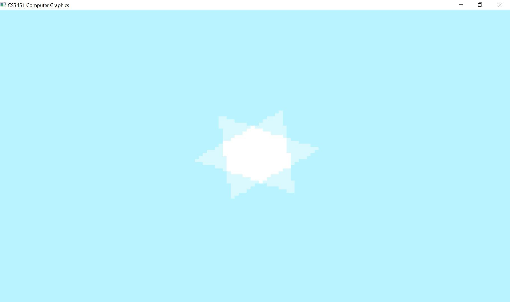

# CS3451 Computer Graphics Starter Code

## 0. Quick Guide

If you are already experienced with using CMake to generate a C++ project, please read the following paragraphs for a quick guide. If not, you may read Section 1 and 2 first and then get back to check this section as a summary.

### Code Structure

The starter codebase is organized as `ext`, `src`, `assignments` and `tutorials`. We put all external codes (e.g., the Eigen library) in `ext`. We put the common headers that can be shared among different subprojects in `src` (e.g., the classes of mesh, grid, file IO, etc.). The folder `assignments` maintains all assignments. An assignment is dependent on `src` and `ext`, but is independent from other assignments.

Usually, you are asked to write code in one or multiple files in an assignment folder. You don’t need to change files in ext or src.

### Build and Compile

We use CMake to separate the source code and the build files. `CMakeLists.txt` is maintained in each subproject. 
To generate build files (e.g., an .sln file for Windows or a makefile for Linux), you need to 1) create a `build` folder to hold all subprojects; 
2) use CMake to generate the build files (i.e., run `cmake <path to source>` in the build folder).

### Executable

The executables are generated in the Release or Debug folder under the subdirectory (e.g., `build/a1/Release`) for Windows and just in e.g. `build/a1` for Linux/Mac.

### Video Tutorial:
Watch the video tutorials made by our awesome TAs Kevin and Vibha:
- **Windows**: https://youtu.be/f6KYyLUswcg
- **OSX**: https://youtu.be/44jzYA2upHU

## 1. Compile and run the first assignment:

### Step 1: Clone the source code from GitLab and enter the codebase folder

    git clone https://gitlab.com/boolzhu/cs3451-computer-graphics-starter-code/
    cd cs3451-computer-graphics-starter-code

### Step 2: Build the project using CMake:

**Substep 2.0: Install CMake**

- **Windows**: Visit https://cmake.org/download/ and download the latest version.  
- **Linux**: `sudo apt-get install cmake`
- **OSX**: `brew install cmake` (using [Homebrew](https://brew.sh/))

**Substep 2.1.0: Install IDE (Windows only)**
  - If you are using Windows and you don't have Visual Studio, please install [Visual Studio 2022] (Community Version) (https://visualstudio.microsoft.com/vs/older-downloads/) , as well as it's [C/C++ support](https://docs.microsoft.com/en-us/cpp/build/vscpp-step-0-installation?view=msvc-150). 
  - Make sure to install the C++ development environment by selecting "Desktop development with C++" under the tag of Workloads.  
  - If you have already installed another version of VS (not Visual Studio 17 2022) or if you are not sure about the version, [check the version](https://stackoverflow.com/questions/33917454/cmake-how-to-specify-the-version-of-visual-c-to-work-with) by running 
  ` camke --help `
  in your command.   
  **Find setup.bat in your script folder, and change "Visual Studio 17 2015" to your own version**, or you might get an error at step 2.2

**Substep 2.1.1: Install Dependencies (Linux/OSX only)**
- **Linux**: `sudo apt-get install freeglut3-dev libglew-dev`
- **OSX**: `brew install glew freeglut`

  
**Substep 2.2: Run setup.sh/bat**

    .\scripts\setup.bat [Windows]
    ./scripts/setup.sh [Linux/OSX]

Note: you need to run the command in your root folder (cs3451-computer-graphics-starter-code). Otherwise your computer will not be able find the cmake file.  

Note: it's possible under OSX environment, run `.sh` gives you `permission denied` exception. Use `chmod u+r+x script_name.sh` to get rid of this.
 

### Step 3: Compile and run the code

To test if everything works correctly you can run:

    .\scripts\run_assignment.bat a1 [Windows]
    ./scripts/run_assignment.sh a1 [Linux/Mac]

This will:

- Compile the code for the assignment 1 and any dependencies
- Popup a window and show an OpenGL window. You should see this image if everything works properly:   

### Step 4: Start implementing!

- **Windows**: Open the .sln project file in the `build` folder.
- **Linux or OSX**: Use your editor of choice to edit the assignment files in `assignments`

## 3. Command line details (optional) 

While the `setup` and `run_assignment` scripts should get you up and running quickly, you might want to peek behind the curtains and run the individual parts manually.

You should familiarize yourself with CMake, which is a tool that allows you to describe your build steps in a platform independent way.

### Setup

During setup, the script creates a directory called `build` in your top level project folder. 
This is standard CMake practice and makes sure that we are not polluting our source code with platform specific build files.

The script enters the directory and executes CMake using `cmake ..`. CMake finds the `CMakeLists.txt' file in the project folder and executes the build setup steps that we configured.

After this runs, you will have a bunch of files and folders in the `build` folder. You might notice that the folder structure mirrors the one in the source folder.

Generally, you can find the build files related to "assignment/aN" in "**build**/assignment/aN". 

### Build

The build step can be done through cmake as well. In the `build` folder, run 

    cmake --build . --config Release
    
This will build all assignments and examples.
    
For more details, you can look at the `setup` and `run_assignment` scripts!
